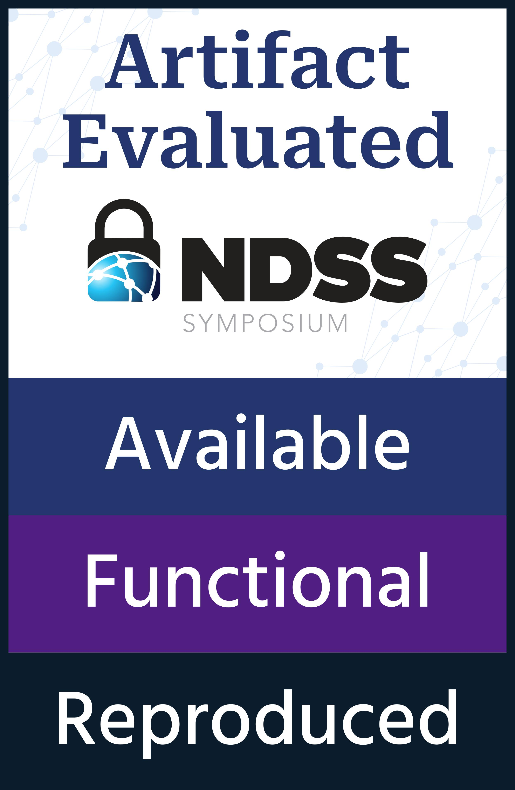

# Artifact for TAPDance - NDSS '24


</img>

This repository contains the code to reproduce the experiments for the paper: [Architecting Trigger-Action Platforms for Security, Performance and Functionality](https://pages.cs.wisc.edu/~dsirone/papers/tapdance_ndss.pdf). The paper's results were obtained by running on a [StarFive VisonFive SBC](https://doc-en.rvspace.org/Doc_Center/visionfive.html) and this repository provides instructions to run the benchmarks on real hardware as well as in an emulated Qemu environment. For conducting the experiments using Qemu, 3 networked machines running Ubuntu 18.04 LTS is required. Building the Docker container needed to run Qemu needs a machine with atleast 30 GB of free space for the docker cache.

The performance claims that are validated by the artifact include:
1. End to End Applet Execution Latency (Section 7.B.3)
2. Applet Execution Latency (Section 7.B.2)
3. Memory Usage of Enclaves (Section 7.B.4)

The functionality claims that are validated by the artifact include:
1. Compilation of 642 out of a total of 682 applets from the minTAP dataset (Section 7, Functionality Evaluation)


## Contents
1. [Artifact Overview](#overview)
2. [Pre-Build](#pre-build)
3. [Building Binaries with Docker](#build)
4. [Setting up Trigger Shim](#trigger-shim)
5. [Setting up Action Shim](#action-shim)
6. [Running Spigot Benchmarks on Real Hardware](#spigot)
7. [Running the Compiler Functionality Test using Docker](#compiler-docker)

## Artifact Overview <a name="overview"></a>
The directory and sub-repository structure is as follows:
- `StaticScript`: Repository containing the TypeScript to LLVM-IR compiler, based on a fork of StaticScript
- `action-shim`: Python server emulating an action service
- `baseline-tap`: Interpreted Node.js TAP server which is used as the performance baseline in experiments
- `keystone`: Repository containing a fork of the Keystone framework, ported to run on StarFive VisionFive along with secure time and nonce management
- `rule-cryptor`: Python script to encrypt an applet binary, used as part of the applet build process
- `scripts`: Scripts for running the performance benchmarks and summarizing results
- `static-script-runtime`: Applet runtime providing TypeScript library functionality to applets
- `tap-apps`: Repository containing all the TypeScript applets, the code for the applet enclave, keystore, time enclave and for running an applet in a regular process
- `tap-client`: Program to register a new user and applet with the Keystore
- `trigger-shim`: Python server emulating a trigger event generator
- `Dockerfile`: Dockerfile for building all the benchmark applets, running the TypeScript compiler and running all the benchmarks in Qemu

## Pre-Build (For Running using Qemu and Running on Real H/W) <a name="pre-build"></a>

**This step requires 20-30 mins**

Provision 2 machines running Ubuntu 18.04 LTS for the trigger and action shims. Both the machines should have a publicly addressable hostname. For artifact evaluation purposes, the authors will be providing these servers.

## Building (For Building Artifact Binaries and Running Compilation Functionality Evaluation) <a name="build"></a>

Clone the repository on the build machine using:
```
git clone https://github.com/multifacet/tap_artifact
```

**Warning** Building the docker container requires atleast 30 GB of free space in the local docker cache. Install docker following the [instructions](https://docs.docker.com/engine/install/) for the build machine's distro.

**The build step takes 40-60 minutes**

Build the Qemu docker container using:

```
docker build --build-arg triggerHostname=<trigger_hostname> --build-arg triggerPort=80 --build-arg actionHostname=<action_hostname> --build-arg actionPort=80 -t dsirone/tapdance:latest .
```

This will build the Qemu container having all the benchmark applet enclaves configured to pull data from the trigger service and push data to the action service.

The `/build/bin` subdirectory contains all the binaries that should be run on the board.


## Setting up Trigger Shim <a name="trigger-shim"></a>

**This step requires 5-10 mins**

The trigger shim serves as the source of event data as well as the source of event notification for the applet enclave. The trigger data source is simulated using a python server whereas the event notifications are generated by `wrk` the HTTP performance benchmarking tool.

Clone and build `wrk` on the trigger service machine as follows:

```
git clone https://github.com/deepaksirone/wrk && cd wrk && make
```

Clone and build the trigger service repository on the trigger service machine:

```
git clone https://github.com/deepaksirone/trigger-shim && cd trigger-shim && ./build.sh
```

To run the trigger service serving encrypted trigger data (for Spigot and Spigot without enclaves) run:

```
sudo python3.7 server.py 0.0.0.0 80 --encrypted
```

## Setting up Action Shim <a name="action-shim"></a>

**This step requires 5-10 mins**

Clone and build the trigger service repository on the trigger service machine:

```
git clone https://github.com/deepaksirone/action-shim && cd action-shim && ./build.sh
```

Run the action service using:

```
sudo python3.7 server.py 0.0.0.0 80
```

## Running Spigot Benchmarks on Real Hardware <a name="spigot"></a>

**This step requires 5-10 mins**

This subsection assumes access to the StarFive VisionFive SBC (referred to as the board) preloaded with all the benchmark applets at `/home/riscv/artifact_eval`. All the enclave benchmark packages (the 10 chosen for evaluation) are located at `/home/riscv/artifact_eval/benchmarks_prebuilt`. All the files starting with `enc_rule_<TypeScript_fname>.ke` are Spigot applet enclave packages corresponding to the TypeScript applet \<TypeScript_fname\> . All the files starting with `rule_process_<TypeScript_fname>.ke` are Spigot benchmark packages that do not use enclaves.

The corresponding TypeScript benchmarks are located in the `tap-apps/benchmark_applets` submodule of this repository.

Open a terminal connection to the board and navigate to the artifact directory (`/home/riscv/artifact_eval`):

Load the keystone kernel module:

```
$ sudo insmod keystone-driver.ko
```

Run the time keeping enclave to synchronize the SM time:

```
$ ./ntp_client.ke
```

Start the Keystore by running:

```
$ cd keystore
$ ./keystore.ke
```

The Keystore will listen on port 7777 on the board. All the benchmark rules are pre-registered with the Keystore.

### Running a Spigot Benchmark (with Enclaves)

**This step requires 40 mins - 1.5 hours**

Make sure that the trigger and action shims are setup and running. The trigger shim should be running with the `--encrypted` flag. Select the package for a benchmark and run it using

```
$ sudo ./enc_rule_<TypeScript_fname>.ke > spigot_<TypeScript_fname>.log
```

This will launch the applet enclave which then connects to the keystore to retrieve the keys needed to decrypt the applet. The host process listens on port 80 and waits for event notifications. On receving an event notification (from `wrk`) the applet enclave will fetch encrypted trigger data from the trigger shim, decrypt it and run the applet on it. It then encrypts the results and sends it to the action service

To start sending event notifications, open a terminal to the trigger shim machine and run:

```
$ cd wrk
$ ./run_wrk.sh spigot <TypeScript_fname>
```

This will generate logfiles of the form `spigot_<TypeScript_fname>.<num_connections>_<num_threads>.log` where `{(<num_connections>, <num_threads>)} are {(1, 1), (2, 2), (3, 3)}` (See Figure 5). After every run of `wrk` restart the enclave by Ctrl^C (a few times) followed by:
```
$ sudo ./enc_rule_<TypeScript_fname>.ke
```

Verify that the run worked by checking the logs of the action service.

After every run of `wrk`, statistics of the run are printed which are redirected to `spigot_<TypeScript_fname>.<num_connections>_<num_threads>.log`. The `Requests/sec:` row is taken as the throughput while the `Latency:` under thread stats is taken as the average request latency per run.

### Running a Spigot Benchmark (Without Enclaves)

**This step requires 40 mins - 1.5 hours**

Make sure that the trigger and action shims are setup and running. The trigger shim should be running with the `--encrypted` flag. Select the package for a benchmark and run it using

```
$ sudo ./rule_process_<TypeScript_fname>.ke > spigot_base_<TypeScript_fname>.log
```

This will launch the applet enclave which then connects to the keystore to retrieve the keys needed to decrypt the applet. The host process listens on port 80 and waits for event notifications. On receving an event notification (from `wrk`) the applet enclave will fetch encrypted trigger data from the trigger shim, decrypt it and run the applet on it. It then encrypts the results and sends it to the action service

To start sending event notifications, open a terminal to the trigger shim machine and run:

```
$ cd wrk
$ ./run_wrk.sh spigot_base <TypeScript_fname>
```

This will generate logfiles of the form `spigot_base_<TypeScript_fname>.<num_connections>_<num_threads>.log` where `{(<num_connections>, <num_threads>)} can be {(1, 1), (2, 2), (3, 3)}` (See Figure 5). After every run of `wrk` restart the enclave by Ctrl^C (a few times) followed by `$ sudo ./rule_process_<TypeScript_fname>.ke `.

Verify that the run worked by checking the logs of the action service.

After every run of `wrk`, statistics of the run are printed which are redirected to `spigot_base_<TypeScript_fname>.<num_connections>_<num_threads>.log`. The `Requests/sec:` row is taken as the throughput while the `Latency:` under thread stats is taken as the average request latency per run.

### Running the Interpreted Baseline

**This step requires 40 mins - 1.5 hours**

Make sure that the trigger and action shims are setup and running. The trigger shim should *not* be running with the `--encrypted` flag, start the trigger shim using:

```
sudo python3.7 server.py 0.0.0.0 80
```

`/home/riscv/artifact_eval/baseline-tap/server.js` provides the baseline implementation of a NodeJS TAP. All the TypeScript applets are stored at `/home/riscv/artifact_eval/baseline-tap/applets`. Line 8 of `server.js` points to the applet that is loaded, edit it to the applet that is going to be run. Lines 27 and 93 correspond to the action and trigger shim URIs respectively, edit them to point to the action and trigger shims respectively.

Run the NodeJS TAP by navigating to `/home/riscv/artifact_eval/baseline-tap` and running:

```
./run_server.sh <TypeScript_applet_id>
```
where `<TypeScript_applet_id>` is the prefix before `.json.ts` of the applet file.

This will record all log messages to `tap_baseline_<TypeScript_applet_id>.log`

To start sending event notifications, open a terminal to the trigger shim machine and run:

```
$ cd wrk
$ ./run_wrk.sh baseline_tap <TypeScript_fname>
```

This will generate logfiles of the form `baseline_tap_<TypeScript_fname>.<num_connections>_<num_threads>.log` where `{(<num_connections>, <num_threads>)} can be {(1, 1), (2, 2), (3, 3)}` (See Figure 5).

After every run of `wrk`, statistics of the run are printed which are redirected to ```baseline_tap_<TypeScript_fname>.<num_connections>_<num_threads>.log```. The `Requests/sec:` row is taken as the throughput while the `Latency:` under thread stats is taken as the average request latency per run.


### Memory Usage of Enclaves

When running an enclave package, check for the line `Requesting n pages from the kernel`. Here n is the total number of pages used by the enclave. Multiply that by the page size (4096) to get the total memory usage of an enclave.

### Memory Usage of NodeJS Baseline

When `server.js` is launched, the `rss` field that is printed out shows the resident set size of the NodeJS interpreter.

### Applet Execution Time

`spigot_<TypeScript_fname>.log` and `spigot_base_<TypeScript_fname>.log` have an "Enclave Exec time: " field that can be averaged to find the average execution time of an enclave execution for spigot with and without enclaves respectively. `tap_baseline_<TypeScript_fname>.log` has an "applet_exec_time" that can be averaged to find the applet execution time.


## Running the Compiler Functionality Test using Docker <a name="compiler-docker"></a>

**This step requires 30 mins - 40 mins**

This step assumes that you have built the Qemu docker container in the previous step. Run the docker container using:

```
docker run --rm -it -p 7022:7022 -p 7080:7080 -p 7777:7777 dsirone/tapdance:latest bash
```

Navigate to the applets repo and run the applet compilation test script:

```
$ cd /build/tap-apps
$ ./check_applets.sh $(pwd)/all_applets
```

This will try to compile all the applets into LLVM IR using [StaticScript](https://github.com/deepaksirone/StaticScript) and print out the resulting statistics


## Summarizing Performance Results
**This step requires 20 mins - 30 mins**

This section describes how to reproduce the various performance claims made in the paper. Please make sure that you have Python 3.8+ installed.

### Summarizing the End to End Latency Results

Copy all the logfiles from the `wrk` runs for a particular configuration (e.g. (spigot, 1 thread, 1 connection)) to separate empty directories (e.g. spigot_1_1).

Run the following:
```
python3 scripts/parse_wrk_dir.py <wrk_logdir>
```
where `wrk_logdirdir` is the log directory for a particular configuration, to obtain the latency and throughput for the particular configuration (e.g. (spigot, 1 thread, 1 connection)).

### Summarizing Applet Execution Times

Copy all the logfiles (e.g. spigot_<TypeScript_fname>.log) from the runs of spigot, spigot_base and the baseline TAP to separate empty directories (eg. spigot_logs, spigot_base_logs, js_baseline_logs).

Run the following:

```
python3 scripts/parse_applet_logdir.py <log_dir> <log_type>
```
where `log_dir` is the log directory for either spigot, spigot_base or the baseline TAP and `log_type` is either `spigot`, `spigot_base` or `baseline_tap` respectively depending on `log_dir`. This will print out the average applet execution time and the average memory usage of all the applets.
